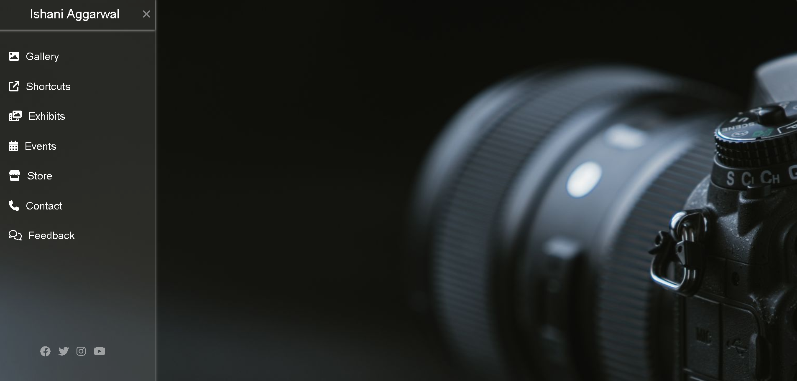

# Sidebar Mini-Project

This project is a simple sidebar navigation built using HTML and CSS. It provides quick access to sections like Gallery, Shortcuts, Exhibits, Events, Store, Contact and Feedback in a visually appealing layout with a background image.

It is a practice project for learning HTML and CSS styling can be used as a base layout for websites.

## Screenshot

## Features

- Sidebar layout built with pure HTML and CSS

- Background image for aesthetic design 

- Consistent font styling using the "Poppins" font family.

- Stylish toggle buttons

- Navigation links: Gallery, Shortcuts, Exhibits, Events, Store, Contact

- Smooth Transitions

- Hover effects on links for better interactivity

- Integrated Social media icons with hover scaling and opacity transitions

- Simple, lightweight, and easy to customize

## Tech Stack

HTML5 → for structuring the sidebar and content

CSS3 → for styling, layout, background image, and hover effects

## Feedback

Still experimenting and open to ideas.

If you spot something I could improve, feel free to share your thoughts here:

- [LinkedIn](https://www.linkedin.com/in/ishani-aggarwal-643259320/)

- [GitHub](https://github.com/IshaniAggarwal)
